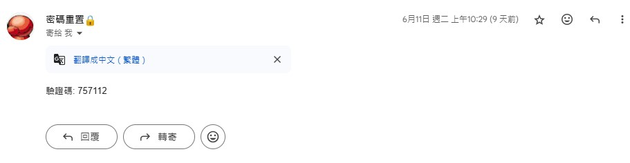
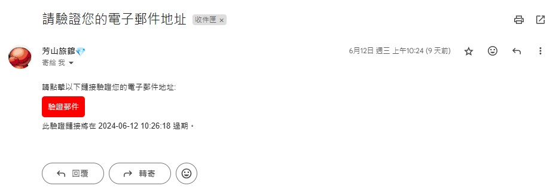
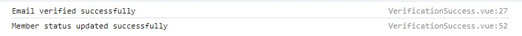
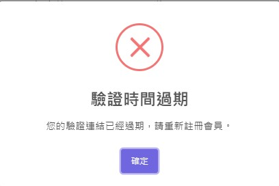
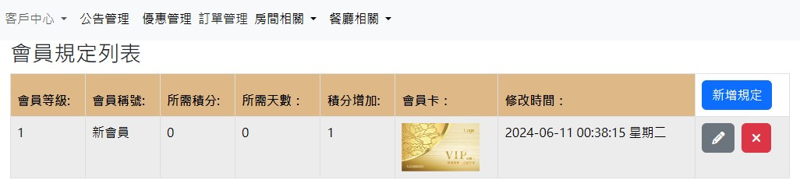
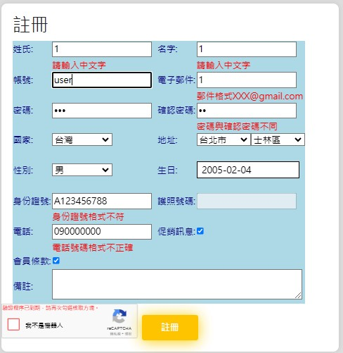
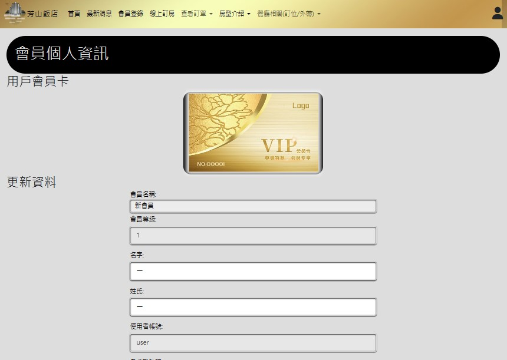
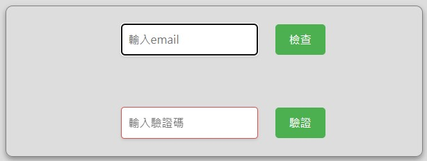
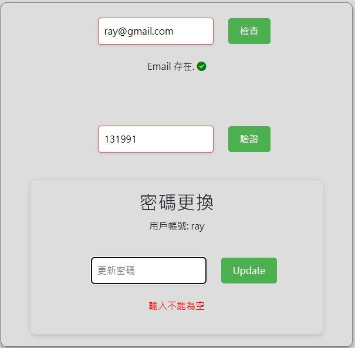
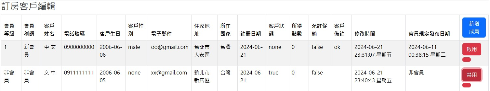

# 寄信功能
寫上自己的**GMAIL**， **二階驗證碼**
**EmailService** 裡的email名稱也要修改 ，機器人認證金鑰
以上改完後端應該能正常運作
## 總結
程式碼功能為，註冊後寄信，忘記密碼提交寄信驗證碼，會員規範增刪改查，圖片增刪改查，會員成員增刪改查等

# hotel 後端
## application.properties
spring.jpa.hibernate.ddl-auto: **Hibernate** 在啟動時會根據實體類別自動建立、更新資料庫表結構的策略，這裡設定為update，表示自動更新
<br>郵件配置:
spring.mail.host=smtp.gmail.com  只支援Gmail<br>
SMTP 伺服器，連接埠為587<br>
## pom.xml
**XML**        版本1.0        編碼UTF-8<br>
**Maven POM**  版本4.0.0<br>
版本號:開發中版本0.0.1-SNAPSHOT   將Maven項目打包成**WAR**文件<br>
屬性配置:
**java**版本17<br>
**log4j-core**版本2.17.1最新版2.17應該不會受log4j漏洞影響<br>
**Servlet API**版本3.0.1在3.0提高對CSRF防護<br>
spring-boot-starter-thymeleaf<br>
spring-boot-starter-web<br>
spring-boot-starter-mail寄信<br>
spring-security-crypto輸入的密碼加密<br>
spring-boot-starter-tomcat 10版本<br>
spring-boot-devtools開發時用:自動重新啟動<br>
lombok自動生成程式碼:例如:getter,setter<br>
mssql-jdbc連接SQL<br>
json版本20240303<br>

## JavaBean
**Customer.java**:<br> 
多對一MemberRank 的mr_id 使用@JsonIgnore  避免因為雙向關聯循環引用無限遞歸<br>
verificationToken:<br>
寄信時輸出專屬驗證碼到資料庫與驗證信的連結。<br>
verificationTokenExpiration:<br>
驗證信有效時間:LocalDateTime<br>
lastModifiedDat:<br>
物件持久化到資料庫之前先執行@PrePersist，如果為空值，使用現在時間，@PreUpdate在onUpdate()中，每次更新時，一併更新時間，顯示

**MemberRank.java**:<br>
@Lob儲存大型物件
byte[]二進制儲存圖片


**技術和框架**<br>
Java Persistence API (JPA)<br>
Jakarta Persistence (formerly Java EE Persistence)<br>
Spring Framework<br>
Java 8 Date-Time API<br>
byte[] photoFile儲存會員卡圖片用<br>

## AppConfig
使用Spring Security提供的**BCryptPasswordEncoder**密碼加密器，提高安全性。調用@Bean方法會員註冊輸入密碼後會進行加密在放到資料庫裡。<br>

## Service
使用JavaMailSender介面。創建多用途互聯網郵件擴展發送郵件。MimeMessageHelper簡化發送郵件過程，設置寄件人名稱，主題。(允許HTML格式)郵件的樣式是在後端寫的。<br>
**密碼重置**:功能<br>
驗證碼使用隨機六位亂數:verificationCode隨著每封發送的郵件而不同<br>

<br>
**會員驗證信**:功能<br>
verificationToken產生唯一識別碼(UUID)，字串方式傳回的驗證識別碼<br>
使用Java 8 的ChronoUnit再給予的現在時間LocalDateTime增加分鐘，並保存在用戶資料庫<br>
驗證信的連結:
http://localhost:5173/pages/verificationSuccess?email=" + email + "&token="+ verificationToken;<br>
這裡localhost:5173是前端port，用戶輸入的email，還有產生的token都包含在連結裡。<br>
<br>
點擊驗證信<br>
<br>
註冊後預設會員狀態為none，驗證成功後更新為true<br>

<br>
如果沒在兩分鐘內點擊驗證連結的話，要重新註冊。<br>
<br>
@Transactional如果發生異常，回復到修改前的狀態。<br>
## Controller
使用Spring框架的 RESTful API處理HTTP請求進行增刪改查操作<br>
@RequestMapping將控制器所有請求對應到("/")路徑底下<br>
@CrossOrigin跨域請求，為了使用前後端分離。<br>
@Autowired依賴注入<br>
使用JSONArray的array儲存每位房客的訊息，並且都表示為一個JSON物件添加到array<br>
在Customer外鍵引用MemberRank資料，先判斷是否為空，避免空值產生異常。<br>
日期格式化:只要更新資料就會更新日期為現在日期<br>
用{username}使用者帳號來獲取用戶訊息<br>
**圖片**:MultipartFile處理圖片上傳，不需像Base64進行編碼與解碼。前端直接使用後端返回的URL。
<br>


# hotel_front

This template should help get you started developing with Vue 3 in Vite.

## Recommended IDE Setup

[VSCode](https://code.visualstudio.com/) + [Volar](https://marketplace.visualstudio.com/items?itemName=Vue.volar) (and disable Vetur).

## Customize configuration

See [Vite Configuration Reference](https://vitejs.dev/config/).

## Project Setup

```sh
npm install
```

### Compile and Hot-Reload for Development

```sh
npm run dev
```

### Compile and Minify for Production

```sh
npm run build
```
--------------------------------------------------------<br>
使用Node.js 處理URL和文件路徑，使用Vite前端開發工具。<br>
將URL物件轉換為文件路徑字串。<br>

**@vitejs/plugin-vue** <br>負責處理.vue檔案的編譯與轉換。<br>
alias:設定模組別名，這裡用@代表src目錄的路徑<br>

**相關設定:**<br>
目前版本v0.0.0<br>
private:true 私有專案，不會被意外地發佈到 npm 上。<br>
ES模組<br>
FontAwesome:提供icon v6.5.2<br>
axios:發送HTTP請求 v1.6.8<br>
Bootstrap:提供樣式 v5.3.3<br>
flatpickr:日期選擇器 v4.6.13<br>
lodash:按下按鈕出現加載圖片 v4.17.21<br>
sweetalert2: v11.11.0<br>
vue: v3.4.7<br>
vue-router:路由v4.3.2 <br>
vuex:管理登入狀態訊息v4.1.0<br>
@vitejs/plugin-vue:熱更新 v5.0.4<br>
vite:v5.2.8<br>

### .env
VITE_BACKEND_URL=http://localhost:8080<br>

### main.js
使用vue3新引入的函數createApp創建vue應用<br>

### index.js
**vuex** 配置，管理全域狀態<br>
使用vuex提供的函數createStore建立儲存實例<br>
**state** 物件定義兩種狀態屬性:<br>
username使用者帳號<br>
isAuthenticated判斷是否通過郵件驗證，預設false <br>
**mutations** 物件修改狀態<br>
isAuthenticated :true<br>
登出後isAuthenticated變成false<br>
**getters** 物件定義獲取資料<br>
<br>
### router.js
使用Vue Router中的一個功能**meta: { requiresAuth: true }**設定需要登入才能訪問的網頁<br>
**router.beforeEach((to, from, next) => { ... });**每次訪問網頁時判斷是否經過登入驗證，若沒有則自動跳到登入的頁面<br>
<br>
註冊網頁:<br>
總積分預設為0，會員等級預設為1，會員狀態預設none，以上使用type: 'hidden'隱藏後再註冊完後上傳至資料庫。<br>
error-message將錯誤訊息顯示在輸入欄下方。<br>
watch選項監控密碼欄位變化，密碼欄位改變，清空確認密碼欄位<br>
動態載入機器人驗證API:https://www.google.com/recaptcha/api.js<br>

<br>
會員編輯:<br>
使用Vuex提供的mapState輔助函數。computed生成username屬性值
axios.get(`/api/customers/${this.username}`)獲取登入的username<br>


<br>

忘記密碼:<br>
先不顯示更新密碼的表單<br>
<br>
輸入自己註冊時用的email<br>
通過axios的GET請求查詢這個email，並同時發送驗證碼<br>
輸入與資料庫email匹配的驗證碼，顯示更新密碼表單<br>
<br>


# hotel_backend

This template should help get you started developing with Vue 3 in Vite.

## Recommended IDE Setup

[VSCode](https://code.visualstudio.com/) + [Volar](https://marketplace.visualstudio.com/items?itemName=Vue.volar) (and disable Vetur).

## Customize configuration

See [Vite Configuration Reference](https://vitejs.dev/config/).

## Project Setup

```sh
npm install
```

### Compile and Hot-Reload for Development

```sh
npm run dev
```

### Compile and Minify for Production

```sh
npm run build
```
客戶編輯:(包含註冊過的會員與非會員)<br>
檢查memberRank存在?不存在顯示非會員<br>
根據memberStatus判斷為true則按鈕顯示禁用，其他的為啟用<br>
<br>


